## Ejercicios de Mapeo del Modelo E-R a Relacional

## Ejercicio 1

### Modelo E-R
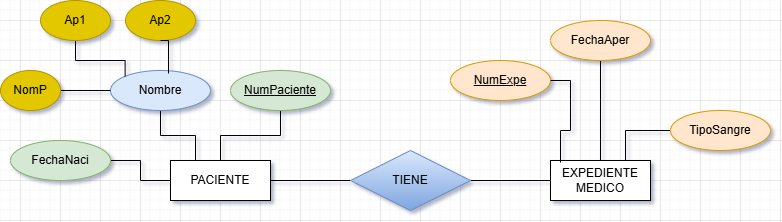

### Modelo Relacional
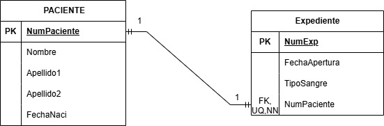

## Ejercicio 2

### Modelo E-R
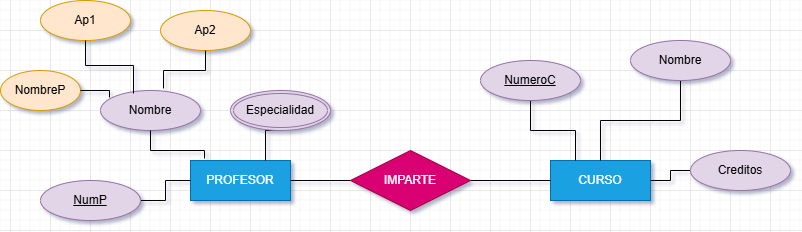

### Modelo Relacional
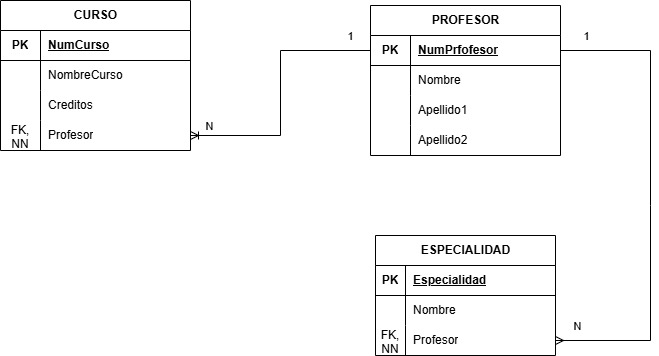

## Ejercicio 3

### Modelo E-R
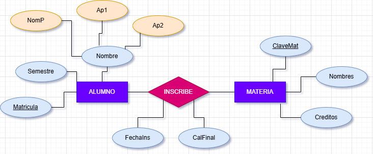

### Modelo Relacional
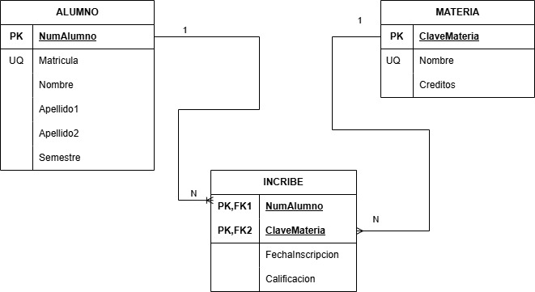

## Ejercicio 4

### Modelo E-R
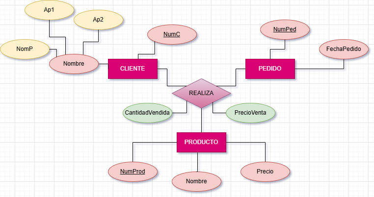

### Modelo Relacional
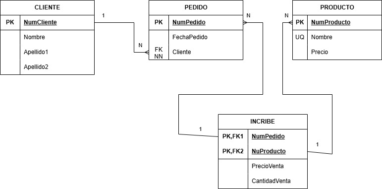

## Ejercicio 5

### Modelo E-R
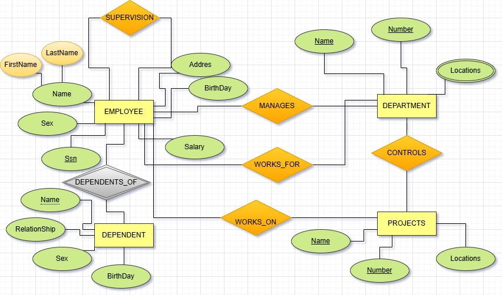

### Modelo Relacional

## Ejercicio 6

### Modelo E-R
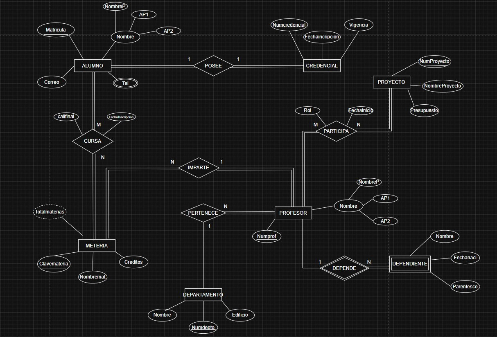

### Modelo Relacional
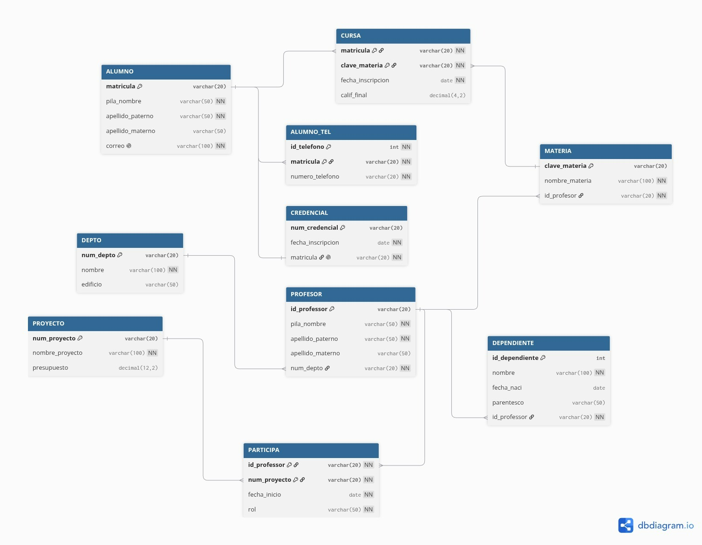