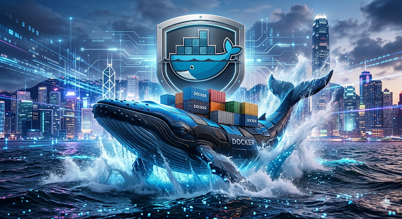

# Documentación de Contenedores Docker de Sistemas Gestores de Base De Datos

## Contenedor de tutorial de docker
docker pull docker/getting-started

docker pull mcr.microsoft.com/mssql/server:2022-latest

docker pull postgres:14.22-trixie 

docker run -d -p 80:80 docker/getting-started

- -d detach (El proceso del contenedor se ejecuta en background)
- -p (port, publish) (Mapea el puerto)
- docker/getting-started (Nombre de la imagen)
## Contenedor del DBMS MariaDB
docker pull mariadb

## Contenedor de MariaDB sin volumen
docker run --name ServerMariaDBG2 -e MARIADB_ROOT_PASSWORD=123456 \
-d -p 3345:3306 e0236

## Contenedor de MariaDB con volumen
docker run --name ServerMariaDBG2 -e MARIADB_ROOT_PASSWORD=123456 \
-d -v v-mariadbg2:/var/lib/mysql -p 3345:3306 e0236

## Contenedor de Postgres con volumen
docker run --name ServerPostgresG2 -e POSTGRES_PASSWORD=123456 \
-d -p 5457:5432 -v v-postgresg2:/var/lib/postgresql/data eba8d

## Contenedor de SQLServer 2022 con volumen
docker run -e "ACCEPT_EULA=Y" -e "MSSQL_SA_PASSWORD=P@ssw0rd" \
   -u 0 \
   -p 1452:1433 --name SQLServerG2 \
   -d -v v-sqlserverg2:/var/opt/mssql/data \
   d01cc
 
## Comandos Docker
| Comando | Descripción |
| :--- | :--- |
| docker pull nombre_imagen | **Descarga una imagen de DockerHub** [Docker Hub](https://hub.docker.com/) |
| docker images | **Visualizar las imagenes que se encuentran en el docker** |
| docker ps | **Visualiza todos los contenedores que están encendidos** |
| docker ps -a | **Visualiza todos los contenedores que están encendidos y apagados** |
| docker stop idcontenedor o nombrecontenedor | **Detiene un contenedor** |
| docker start idcontenedor o nombrecontenedor | **Enciende un contenedor** |
| docker rm idcontenedor o nombrecontenedor | **Elimina un contenedor si está apagado** |
| docker rm -f idcontenedor o nombrecontenedor | **Elimina un contenedor esté o no encendido** |

